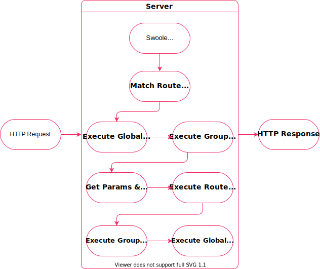

# Demo of utopia-php/swoole

This project uses the [Utopia framework](https://github.com/utopia-php/framework) and [Swoole](https://github.com/utopia-php/swoole) to build a very simple API, demonstrating how to define routes and start the server, both found in the server entrypoint `./app/server.php`.

## Install
```bash
git clone https://github.com/kodumbeats/utopiademo
cd utopiademo
composer install
docker-compose up -d
```

## Use
The docker-compose config will mount the root folder to `/app` in the container, so you can actively develop your code. To apply changes, restart the stack with:

  `docker-compose restart`

## Request Flow


## Resources

- [utopia-php/framework](https://github.com/utopia-php/framework)
- [utopia-php/swoole](https://github.com/utopia-php/swoole)
- [utopia-php/cli](https://github.com/utopia-php/cli)
